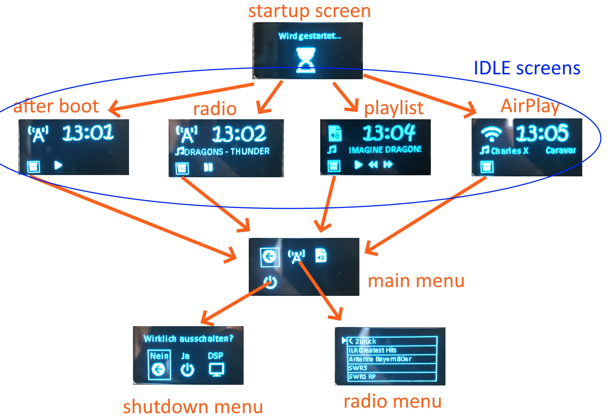

# RasPi-OLED-Menu

This code is for a homemade internet radio.
It is based on a Raspberry Pi Zero W with a USB sound card.
Only controllable via a web interface was no option for me, so I added a small OLED display and a rotary encoder.
There should be a menu to navigate through with the rotary encoder.
The controller chip of the little oled is the sh1106. (I bought it from ebay)

It connects to Mopidy for music playback and webradio stations and to shairport-sync for airplay status information.

## Usage
Here is a graphic that shows the different screens:


## Installation
The code is provided without further warranty or support. There is no guarantee that it will work properly, since I am not a professional developer and only develop this project in my spare time.
1. Install [Raspberry Pi OS](https://www.raspberrypi.org/downloads/raspberry-pi-os/) to your SD Card and set it up (there are lots of great guides online)
2. Install some prerequisites: ``` sudo apt-get install python3-dev python3-pip libfreetype6-dev libjpeg-dev build-essential libopenjp2-7 libtiff5 screen```
3. Download the code: ``` git clone https://github.com/techdiem/RasPi-OLED-Menu.git oled && cd ./oled```
4. Install python requirements: ``` pip3 install -r requirements.txt ```
5. Move font files to the ```fonts``` directory, they aren't included due to their copyright. [instructions](fonts/README.md)
6. Set the pinout and other configuration values with ``` nano settings.ini ```
7. Move the systemd config to the correct folder: ``` sudo mv oled.service /etc/systemd/system/ ```
8. Reload systemd: ``` sudo systemctl daemon-reload ```

Start it using ``` python3 oled.py ``` for debug and using ``` sudo systemctl start oled.service ``` for production.
To start on system boot, use ``` sudo systemctl enable oled.service ```.
